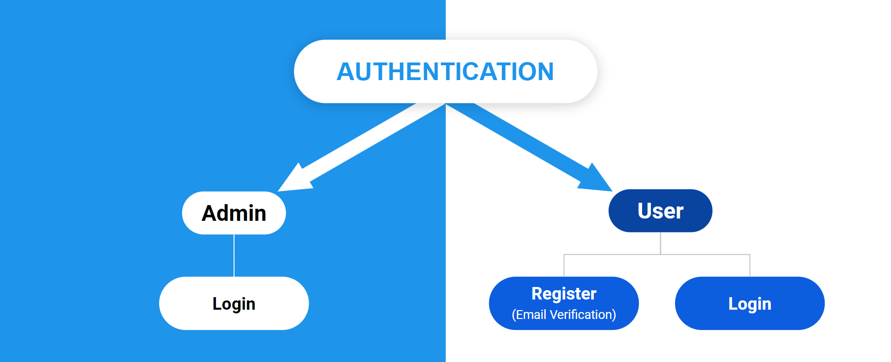

# Laravel Multi-Level Authentication

In this tutorial I will explain how create separate user and admin panel authentication.

Must watch [this video](https://youtu.be/jRq-cGMqmVk) to learn practical application of this tutorial

## Installation

Create a laravel project

    composer create-project laravel/laravel=9.1 example-app

Install laravel `breeze` package

    composer require laravel/breeze=1.9 --dev
    php artisan breeze:install
    npm install
    npm run dev

Create a database and update `.env` file with your database credentials and then run migration

    php artisan migrate

## Create Admin Panel

Create a `modal` for admin

    php artisan make:model Admin -m

-   Copy `users` columns to `admin` migration file
-   Copy all text from `User` model to `Admin` model and set the class name `Admin`

Create all necessary `routes` for admin authentication

    /*
    |--------------------------------------------------------------------------
    | Admin Routes
    |--------------------------------------------------------------------------
    */

    Route::get('/admin/login', [AuthenticatedSessionController::class, 'create'])->name('admin.login')->middleware('guest:admin');

    Route::post('/admin/login/store', [AuthenticatedSessionController::class, 'store'])->name('admin.login.store');

    Route::group(['middleware' => 'admin'], function() {

        Route::get('/admin', [HomeController::class, 'index'])->name('admin.dashboard');

        Route::post('/admin/logout', [AuthenticatedSessionController::class, 'destroy'])->name('admin.logout');

    });

-   create `Admin` folder on `controller`
-   `controller` => `Admin` => `Auth` => copy `AuthenticatedSessionController.php` from user `Auth`
-   `AuthenticatedSessionController.php` =>

        namespace App\Http\Controllers\Admin\Auth;
        use App\Http\Requests\Auth\AdminLoginRequest;

        public function create()
        {
            return view('admin.auth.login');
        }

        public function store(AdminLoginRequest $request)
        {
            $request->authenticate();

            $request->session()->regenerate();

            return redirect()->intended(RouteServiceProvider::ADMIN_HOME);

        }
        public function destroy(Request $request)
        {
            Auth::guard('admin')->logout();

            $request->session()->invalidate();

            $request->session()->regenerateToken();

            return redirect('/');

        }

-   go to RouteServiceProvider and do it:

        public const HOME = '/dashboard';
        public const ADMIN_HOME = '/admin';

-   create `admin` folder on views, create `auth` folder on admin and copy-paste `login` view from `user > auth`

-   You can specify the admin login page

        <x-slot name="logo">
            <a href="/">
            <x-application-logo class="w-20 h-20 fill-current text-gray-500" />
            </a>
            Admin Login
        </x-slot>

-   to view login link paste it in welcome page anywhere

        @auth('admin')
            <a href=" {{ route('admin.dashboard') }} ">Admin Dashboard</a>
        @else
            <a href=" {{ route('admin.login') }} ">Admin Login</a>
        @endauth

-   set action in admin login form

        <form method="POST" action="{{ route('admin.login.store') }}">

-   Create a `seed` for admin

        php artisan make:seeder AdminSeeder

    -   `AdminSeeder.php` =>

            use App\Models\Admin;

            public function run()
            {
                $admin = [
                    'name' => 'Mamunur Rashid Mamun',
                    'email' => 'admin@example.com',
                    'password' => bcrypt('12345678')
                ];
                Admin::create($admin);
            }

-   go to `DatabaseSeeder.php` and do it:

        public function run()
        {
            $this->call([
                AdminSeeder::class,
            ]);
        }

-   seed the database

        php artisan db:seed

Creating guard:

-   go to Admin model and do it:

          use HasApiTokens, HasFactory, Notifiable;
          protected $guard = 'admin';

-   go to `config` => `auth.php` =>

        'guards' => [
            'web' => [
                'driver' => 'session',
                'provider' => 'users',
            ],
            'admin' => [
                'driver' => 'session',
                'provider' => 'admins',
            ],
        ],

        'providers' => [
            'users' => [
                'driver' => 'eloquent',
                'model' => App\Models\User::class,
            ],
            'admins' => [
                'driver' => 'eloquent',
                'model' => App\Models\Admin::class,
            ],
        ],

-   go to `middleware` => `RedirectIfAuthenticated.php` =>

        public function handle(Request $request, Closure $next, ...$guards)
        {
            $guards = empty($guards) ? [null] : $guards;

            foreach ($guards as $guard) {
                if (Auth::guard($guard)->check()) {

                    if($guard == 'admin') {
                        return redirect(RouteServiceProvider::ADMIN_HOME);
                    }
                    return redirect(RouteServiceProvider::HOME);
                }
            }

            return $next($request);
        }

-   `App` => `Http` => `Request` => `Auth` => `LoginRequest.php` > duplicate and set name `AdminLoginRequest.php` > change the classname to `AdminLoginRequest` >

        public function authenticate()
        {
            $this->ensureIsNotRateLimited();

            if (! Auth::guard('admin')->attempt($this->only('email', 'password'), $this->boolean('remember'))) {
                RateLimiter::hit($this->throttleKey());

                throw ValidationException::withMessages([
                    'email' => trans('auth.failed'),
                ]);
            }

            RateLimiter::clear($this->throttleKey());
        }

-   create admin dashboard by duplicating user dashboard
-   create `HomeController`

        php artisan make:controller Admin/HomeController

    -   `HomeController.php` =>

            class HomeController extends Controller
            {
                public function index() {
                    return view('admin.dashboard');
                }
            }

-   copy user layout view folder to admin
-   `App` => `view` => `components` => duplicate `AppLayout.php` to `AdminLayout.php` and change class name to `AdminLayout`

        public function render()
        {
            return view('admin.layouts.app');
        }

-   change layouts file view from user to admin

-   Create middleware for admin

          php artisan make:middleware AdminMiddleware

    -   `AdminMiddleware.php` =>

            use Auth;
            public function handle(Request $request, Closure $next)
            {
                if(!Auth::guard('admin')->check()) {
                    return redirect()->route('admin.login');
                }
                return $next($request);
            }

-   go to `App` => `Http` => `Kernel` =>

        protected $routeMiddleware = [
            'admin' => \App\Http\Middleware\AdminMiddleware::class,
        ];
